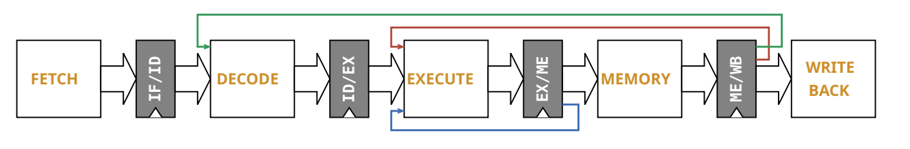

# Mini RISC-V Processor Implementation

This project implements a **5-stage pipelined RISC-V CPU core** in VHDL, synthesized and physically implemented using Cadence tools and the **GPDK045** 45 nm technology. It follows a full **VLSI design flow**, including simulation, synthesis, place-and-route, and timing analysis.

---

## 📜 Project Overview

The processor was designed from scratch in VHDL, supporting essential RISC-V instructions, with all pipeline stages implemented and verified:

- **Fetch**
- **Decode**
- **Execute**
- **Memory**
- **Write-back**

The design was verified through **behavioral simulation** (pre-synthesis) and **timing simulation** (post-synthesis and post-layout netlists). Physical implementation was performed with automated Cadence flows.

---

## 📊 Physical Implementation

The project uses industry-standard design constraints:

- **`timing.sdc`** — Defines the timing environment (clocks, delays, input/output constraints, uncertainties, false paths).
- **`mmmc.tcl`** — Sets up Multi-Mode Multi-Corner (MMMC) analysis, specifying PVT corners, RC corners, and library sets for both **setup** (slow corner) and **hold** (fast corner) analysis.

The **placement and routing** stage was carried out using the Cadence Innovus flow with scripts in `scripts/` to automate each step.

---

## 📂 Project Structure

| Folder          | Description |
|-----------------|-------------|
| `asm/`          | Assembly code and Makefile to test the processor. |
| `constraints/`  | Timing constraints (`timing.sdc`) and multi-corner setup (`mmmc.tcl`). |
| `doc/`          | Full project documentation (in French). |
| `scripts/`      | TCL scripts for synthesis, placement & routing, and simulation automation. |
| `sources/hdl/`  | All VHDL source files for each module. |
| `sources/mem/`  | Memory initialization files. |
| `sources/sim/`  | Testbenches for each module. |

---

## 🖼 Pipeline Architecture

---

## 🛠 Tools & Technology

- **Language:** VHDL
- **Technology:** Cadence GPDK045 (45 nm)
- **Tools:** Cadence Genus (synthesis), Cadence Innovus (P&R), Cadence SimVision (simulation)
- **Provider:** [CMC Microsystems](https://www.cmc.ca/WhatWeOffer/Products/CMC-00200-04870.aspx)

---

## 📌 References

- [Cadence GPDK045](https://www.cmc.ca/WhatWeOffer/Products/CMC-00200-04870.aspx) — Generic 45 nm Process Design Kit
